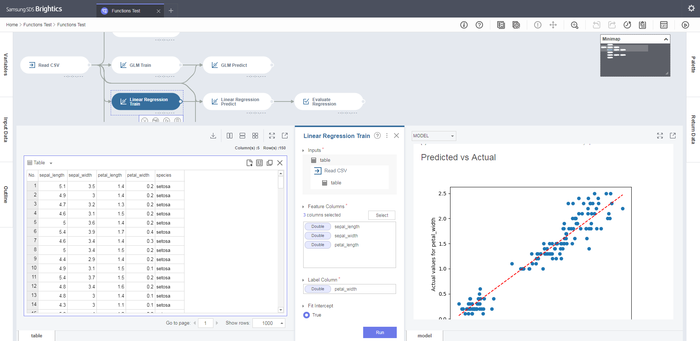
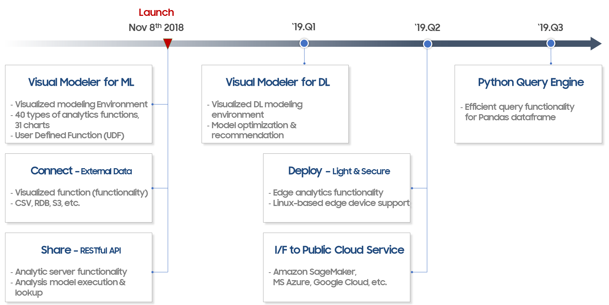

Brightics Studio
================

</img>

## Overview

Brightics Studio is a web-based data analysis workflow tool for data scientists.<br>
Brightics Studio has an intuitive user interface and the interactive GUI will let you find potential insights from your data.<br>
Brightics Studio supports an interface for analytics by wrapping popular python libraries such as scikit-learn and pandas.<br>
Using Brightics Studio, both citizen data scientists and professional data scientists will be able to handle their projects.<br>
Using the Brightics Toolkit, user interfaces for custom functions can be generated and they will be usable in the Brightics workflow.<br>
Charts and report generators are also provided to visualize data in various ways.

## Documentation
Please visit our web site http://www.brightics.ai

## Getting started
### Prerequisite
* Mac OS users have to install [graphviz](http://graphviz.org/download/) using [Homebrew](https://brew.sh/)
```
brew install graphviz
```
* Some functions which interact with database need client libraries such as [Oracle Instant Client](http://www.oracle.com/technetwork/database/database-technologies/instant-client/overview/index.html)

### Download
In the beta phase, the releases and patches will probably be updated every week.<br>
Download release files are available from github release or our web site http://www.brightics.ai/downloads

### Installation
Execute the downloaded file. It will extract files automatically.

	BrighticsStudio-\<version\>-\<os name\>.exe : for windows
	BrighticsStudio-\<version\>-\<os name\>.sh : for linux and mac

Details of the directory is as follows:

	/brightics-studio/brightics-server : core home
	/brightics-studio/visual-analytics : GUI home
	/brightics-studio/lib : external libs

### Launch
You don't need to prepare anything before running it. Our releases contain all requirements in a package itself.<br>
Go to unzipped directory and run.

	start-brightics.cmd : for windows
	start-brightics.sh : for linux and mac

### Patch
If a new version is released, you should move these files to newer version of brightics-studio to maintain data and projects.

	/brightics-studio/visual-analytics/brightics.db
	/brightics-studio/brightics-server/data/*
    
Or download "BrighticsStudio-\<version\>-\<os name\>-patch" and run this from the location of Brightics Studio installation.

## Development
### Prerequisite
 * JDK 1.8, 1.9 (64bit)
 * Python 3.6.x (64bit)
 * Node.js 8.11.2 (64bit)

### Setting up the environment variables
for windows:

    SET JAVA_HOME=<Your Java installation path>
    SET PYTHON_HOME=<Your Python installation path>
    SET NODEJS_HOME=<Your Node.js installation path>
    SET PATH=%PATH;%PYTHON_HOME%\bin;%JAVA_HOME%\bin;%NODEJS_HOME%\bin

for linux-like systems:

    export JAVA_HOME=<Your Java installation path>
    export PYTHON_HOME=<Your Python installation path>
    export NODEJS_HOME=<Your Node.js installation path>
    export PATH=$PATH:$PYTHON_HOME/bin:$JAVA_HOME/bin:$NODEJS_HOME/bin
    
Most common cases you don't need to set above parameters because those projects automatically add paths during their installation process. 

### Build
Build a package with maven.

	mvn clean package -DskipTests [Options]

When the build process is finished, a distribution will be created under build/target/dist directory.

### Create python environment
```
    pip -r brightics-studio\lib\requirements.txt
```

Some of python packages need Microsoft Visual C++ Build Tools.<br>
Please make sure [Microsoft Visual C++ 14.0](https://go.microsoft.com/fwlink/?LinkId=691126) installed when you run the setup command in windows.<br>
Reference : [Python wiki for WindowsCompilers](https://wiki.python.org/moin/WindowsCompilers)<br>

## License
Visual Analytics(Web GUI) project is licensed under the terms of the Brightics Visual Analytics LICENSE, please check Notice below.<br>
The others are licensed under the terms of the Apache 2.0 license.

### Notice
Source codes of the Web GUI are not yet fully opened due to some license issues from its submodules.<br>
The purpose of personal use for commercial or non-commercial is allowed but only the redistribution is prohibited.<br>
See [the documentation about this license](BRIGHTICS_VA_LICENSE) for more details.<br>
We are working hard to solve these issues and soon it will be public.

## Roadmap

</img>

## Contact us
If you like to use Brightics Studio, please let us know your usage and feedback.<br>
Or you have questions while using Brightics Studio, don't hesitate and feel free to contact brightics@samsung.com

