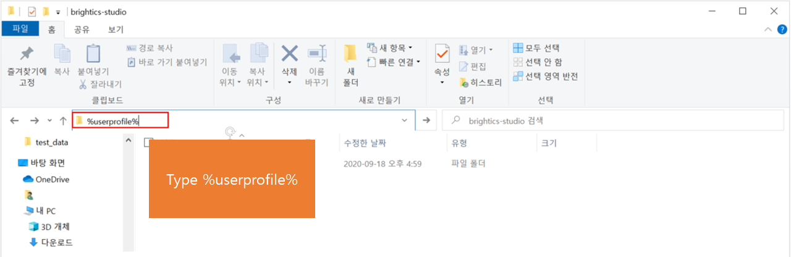
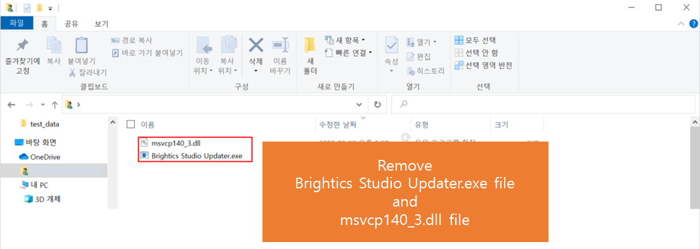
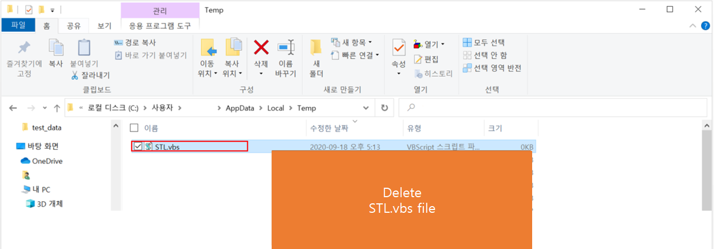

If you have downloaded Brightics Studio windows version v1.1 2020.07,
please use the following steps to handle infected files of Brightics Studio.

Brightics Studio 사용자께 안내 말씀드립니다.
BrighticsStudio-v1.1-2020.07-windows.exe에 악성코드 감염이 발견되어 조치 방법을 안내해 드립니다.

### [For V3 Antivirus program user] <br>
### [V3 백신 프로그램 사용자]
1. Update the antivirus program. <br>
   백신 업데이트 <br>
2. Run Detailed Scan. <br>
   정밀검사 수행

### [How to remove if not using V3 Antivirus program]
### [V3 백신을 사용하지 않을시 삭제방법]


1. Remove brightics-studio folder. (Default installation path is `C:\brightics-studio`) <br>
   설치한 `brightics-studio` 폴더 전체를 삭제해주세요. (기본 설치 경로는 `C:\brightics-studio` 입니다.)


2. Open File Explorer and type `%userprofile%` in the address bar. <br>
   파일 탐색기를 열고 주소 표시창에 `%userprofile%` 을 입력해주세요.


3. If you find `Brightics Studio Updater.exe` file, delete this file. <br>
   If you don't, go to step 4. <br>
   `Brightics Studio Updater.exe` 파일이 존재하면 삭제해주시고 없다면 다음 단계로 넘어가 주세요.
   
4. If you find `msvcp140_3.dll` file, delete this file. <br>
   If you don't, go to step 5. <br>
   `msvcp140_3.dll` 파일이 존재하면 삭제해주시고 없다면 다음 단계로 넘어가 주세요.


5. Open File Explorer and type `%temp%` in the address bar. <br>
   파일 탐색기를 열고 주소 표시창에 `%temp%` 를 입력해주세요.


6. If you find `STL.vbs` file, delete this file. <br>
   `STL.vbs` 파일이 존재하면 삭제해주시고 없다면 다음 단계로 넘어가 주세요. <br>
   If you don't, go to step 7 


7. Open Window Run window. (Press `Window Key + R`)  <br>
   Then type `cmd`   <br>
   윈도키 + R 단축키를 이용하거나 윈도 실행창에서 `cmd` 를 입력해주세요.  <br>


8. When Command Prompt is open, type `SchTasks /DELETE /TN BrighticsStudioUpdater`   <br>
   윈도우 명령어 창이 열리면 `SchTasks /DELETE /TN BrighticsStudioUpdater` 를 입력해주세요.


### [How to reinstall Brightics Studio]
Please, download and reinstall Brightics Studio using the download link beflow.  <br>
아래 링크를 다운로드하여 재설치하시기 바랍니다. <br>
[BrighticsStudio-v1.1-2020.06-windows.exe](https://github.com/brightics/studio/releases/download/v1.1-2020.06/BrighticsStudio-v1.1-2020.06-windows.exe)

If you have any inconvenience or further questions, please contact us  brightics@samsung.com . <br>
사용에 불편을 끼쳐 죄송합니다. 궁금한점이 있으면 brightics@samsung.com 로 연락주세요.


# Brightics Studio v1.1
[](https://github.com/brightics/studio/releases)
[](https://github.com/brightics/studio/releases)
[](https://travis-ci.com/brightics/studio)


[](https://hub.docker.com/r/brightics/studio)
<a href="../../graphs/contributors"></a>
[](https://www.brightics.ai/community/categories)
[](https://www.youtube.com/brighticsTV)

</img>

## Overview

Brightics Studio is a web-based data analysis workflow tool for data scientists.<br>
Brightics Studio has an intuitive user interface and the interactive GUI will let you find potential insights from your data.<br>
Brightics Studio supports an interface for analytics by wrapping popular python libraries such as scikit-learn and pandas.<br>
Using Brightics Studio, both citizen data scientists and professional data scientists will be able to handle their projects.<br>
Using the Brightics Toolkit, user interfaces for custom functions can be generated and they will be usable in the Brightics workflow.<br>
Charts and report generators are also provided to visualize data in various ways.

## Documentation
Please visit our web site http://www.brightics.ai

## Getting started
### Docker Image
The Brightics Studio Docker image is available on [Docker Hub](https://hub.docker.com/r/brightics/studio).

### Prerequisite
* **Optional**: macOS users have to install [graphviz](http://graphviz.org/download/) using [Homebrew](https://brew.sh/) to plot tree figures of Decision Tree. However if it is not easy to install it just skip it.
```
brew install graphviz
```
* Some functions which interact with database need client libraries such as [Oracle Instant Client](http://www.oracle.com/technetwork/database/database-technologies/instant-client/overview/index.html)

### Download
Download release files are available from github release or our web site http://www.brightics.ai/downloads

### Installation
Execute the downloaded file. It will extract files automatically.

	BrighticsStudio-\<version\>-\<os name\>.exe : for windows
	BrighticsStudio-\<version\>-\<os name\>.sh : for linux and mac

Details of the directory is as follows:

	/brightics-studio/brightics-server : core home
	/brightics-studio/visual-analytics : GUI home
	/brightics-studio/lib : external libs

### Launch
You don't need to prepare anything before running it. Our releases contain all requirements in a package itself.<br>
Go to unzipped directory and run.

	Brightics-Studio-Launcher.exe : Launcher for windows
	start-brightics.cmd : for windows
	start-brightics.sh : for linux and mac

### Patch
If a new version is released, you should move these files to newer version of brightics-studio to maintain data and projects.

	/brightics-studio/visual-analytics/brightics.db
	/brightics-studio/brightics-server/data/*
    
Or download "BrighticsStudio-\<version\>-\<os name\>-patch" and run this from the location of Brightics Studio installation.

### Run
Brightics Studio pops up on Chrome browser after launching start-brightics.cmd (or start-brightics.sh). Please go to http://127.0.0.1:3000 manually to use Brightics Studio if it does not pop up automatically.

### Start from AWS Marketplace
Brightics Studio is now available from AWS Marketplace(https://aws.amazon.com/marketplace/pp/B07P4399PD).<br>
It just takes only 1~2 minutes to setup EC2 and launch Brightics Studio.

### Install additional packages
This section explain how to install some python packages to Brightics Studio python environment.

	/brightics-studio/lib/python/python get-pip.py : This step is only needed once.
	/brightics-studio/lib/python/Scripts/pip install <ANY_PACKAGES>

### Notes
Tokenizer (Korean) function will not work properly if the installation path contains Korean characters. You need to install Brightics Studio in a folder whose full path does not contain Korean characters in order to make use of this function.

## Development
### Prerequisite
 * JDK 1.8, 1.9 (64bit)
 * Python 3.6.x (64bit)
 * Node.js 8.11.2 (64bit)

### Setting up the environment variables
for windows:

    SET JAVA_HOME=<Your Java installation path>
    SET PYTHON_HOME=<Your Python installation path>
    SET NODEJS_HOME=<Your Node.js installation path>
    SET PATH=%PATH;%PYTHON_HOME%\bin;%JAVA_HOME%\bin;%NODEJS_HOME%\bin

for linux-like systems:

    export JAVA_HOME=<Your Java installation path>
    export PYTHON_HOME=<Your Python installation path>
    export NODEJS_HOME=<Your Node.js installation path>
    export PATH=$PATH:$PYTHON_HOME/bin:$JAVA_HOME/bin:$NODEJS_HOME/bin
    
Most common cases you don't need to set above parameters because those projects automatically add paths during their installation process. 

### Build
Build a package with maven.

	mvn clean package -DskipTests [Options]

When the build process is finished, a distribution will be created under build/target/dist directory.

### Create python environment
```
    pip -r brightics-studio\lib\requirements.txt
```

Some of python packages need Microsoft Visual C++ Build Tools.<br>
Please make sure [Microsoft Visual C++ 14.0](https://go.microsoft.com/fwlink/?LinkId=691126) installed when you run the setup command in windows.<br>
Reference : [Python wiki for WindowsCompilers](https://wiki.python.org/moin/WindowsCompilers)<br>

## License
Visual Analytics(Web GUI) project is licensed under the terms of the Brightics Visual Analytics LICENSE, please check Notice below.<br>
The others are licensed under the terms of the Apache 2.0 license.

### Notice
Source codes of the Web GUI are not yet fully opened due to some license issues from its submodules.<br>
The purpose of personal use for commercial or non-commercial is allowed but only the redistribution is prohibited.<br>
See [the documentation about this license](BRIGHTICS_VA_LICENSE) for more details.<br>
We are working hard to solve these issues and soon it will be public.

### Contributors

This project exists thanks to all the people who contribute.
<a href="../../graphs/contributors"></a>


## Contact us
If you like to use Brightics Studio, please let us know your usage and feedback.<br>
Or you have questions while using Brightics Studio, don't hesitate and feel free to contact brightics@samsung.com

