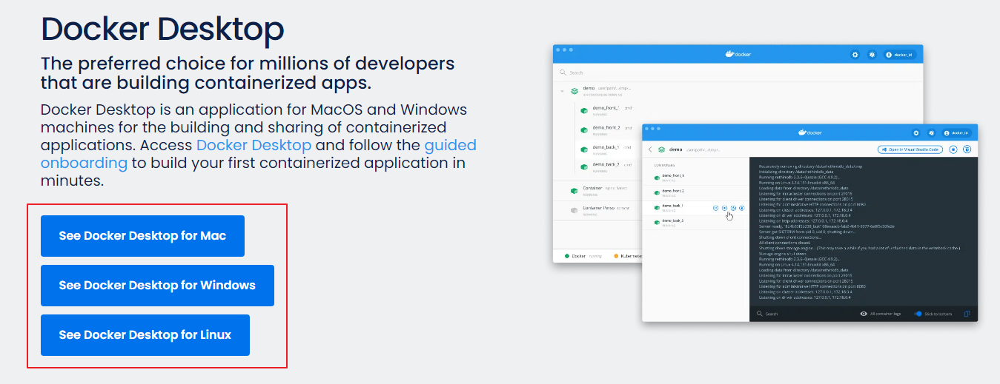

# Brightics Studio v1.3

[](https://github.com/brightics/studio/releases)
[](https://github.com/brightics/studio/releases)
[](https://travis-ci.com/brightics/studio)


[](https://hub.docker.com/r/brightics/studio)
<a href="../../graphs/contributors"></a>
[](https://www.brightics.ai/community/categories)
[](https://www.youtube.com/brighticsTV)

</img>

[[English](README_en.md)]
[[한국어](README.md)]

MacOS / Linux users can use Brightics Studio by following the installation guide below.

## Overview

---

- Brightics Studio is a web-based data analysis workflow tool for data scientists.  
- Brightics Studio has an intuitive user interface and the interactive GUI will let you find potential insights from your data.  
- Brightics Studio supports an interface for analytics by wrapping popular python libraries such as scikit-learn and pandas.  
- Using Brightics Studio, both citizen data scientists and professional data scientists will be able to handle their projects.  
- Using the Brightics Toolkit, user interfaces for custom functions can be generated, and they will be usable in the Brightics workflow.  
- Charts and report generators are also provided to visualize data in various ways.  

## Documentation

---

Please visit our web site https://www.brightics.ai

## Getting started

---

You can install Brightics Studio using a release file or a docker image.

### Prerequisite
#
* Some functions which interact with database need client libraries such as [Oracle Instant Client](http://www.oracle.com/technetwork/database/database-technologies/instant-client/overview/index.html)
* You can use the Brightics Studio Docker image by referring to [Installation - docker](#installation---docker).


### Installation - release file
#
  * Download

      Download release files are available from github release or our web site http://www.brightics.ai/downloads
      
      Execute the downloaded file. It will extract files automatically.

      ```
      BrighticsStudio-\<version\>-\<os name\>.exe : for windows
      BrighticsStudio-\<version\>-\<os name\>.sh : for linux (Ubuntu)
      ```
      
      Details of the directory is as follows:
      
      ```
      /brightics-studio/brightics-server : core home
      /brightics-studio/visual-analytics : GUI home
      /brightics-studio/lib : external libs
      ```


  * Launch

      You don't need to prepare anything before running it. Our releases contain all requirements in a package itself.  
      Go to unzipped directory and run.
        
      ```
      Brightics-Studio-Launcher.exe : Launcher for windows
      start-brightics.cmd : for windows
      start-brightics.sh : for linux (Ubuntu)
      ```
        
      > **Notes**
      >
      > Tokenizer (Korean) function will not work properly if the installation path contains Korean characters.  
      > You need to install Brightics Studio in a folder whose full path does not contain Korean characters in order to make use of this function.


  * Patch
        
      If a new version is released, you should move these files to newer version of brightics-studio to maintain data and projects.
        
      ```
      /brightics-studio/visual-analytics/brightics.db
      /brightics-studio/brightics-server/data/*
      ```


 *  Run
  
      Brightics Studio pops up on Chrome browser after launching start-brightics.cmd (or start-brightics.sh).   
      Please go to http://127.0.0.1:3000 manually to use Brightics Studio if it does not pop up automatically.

### Installation - docker
#
  * Docker

      Install [Docker](https://www.docker.com/get-started/) in user's working environment.
	  </img>


  * Docker Image  

      Docker image is available on [Docker Hub](https://hub.docker.com/r/brightics/studio).

      Run
      ```
      $ docker volume create brightics
      $ docker run -d -p 3000:3000 --privileged=true -v brightics:/brightics-studio/userdata --name brightics brightics/studio:latest
      ```      

      Stop
      ```
      $ docker stop brightics
      ```      

## Contact us
---
If you like to use Brightics Studio, please let us know your usage and feedback.  
Or you have questions while using Brightics Studio, don't hesitate and feel free to contact brightics.cs@samsung.com

## License
---
Visual Analytics(Web GUI) project is licensed under the terms of the Brightics Visual Analytics LICENSE, please check Notice below.  
The others are licensed under the terms of the Apache 2.0 license.

### Notice
#
Source codes of the Web GUI are not yet fully opened due to some license issues from its submodules.  
The purpose of personal use for commercial or non-commercial is allowed but only the redistribution is prohibited.  
See [the documentation about this license](BRIGHTICS_VA_LICENSE) for more details.  
We are working hard to solve these issues and soon it will be public.

### Contributors
#
This project exists thanks to all the people who contribute.
<a href="../../graphs/contributors"></a>


